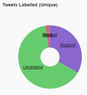
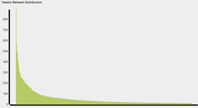
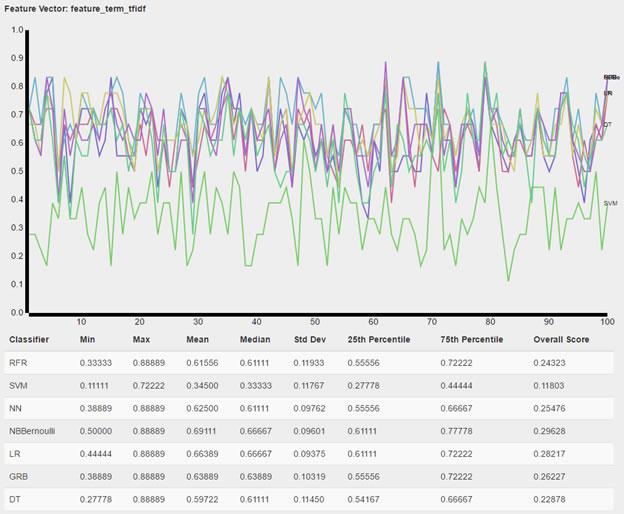

# [fyp_py_web](https://github.com/nossbigg/fyp_py_web) 
Source code for web front-end experiment results visualization and analysis for **A Study on Rumour Detection on Online Social Networks** final year research project.

## Key Features
* Django web interface exposing web services for client-side visualization
* D3.js-driven web visualizations for quick analysis of dataset characteristics and experiment results

## Visualizations
* **Pie Charts** to illustrate porportions of tweets  

* **Bar Charts** to illustrate tweet retweet distribution for popular tweets  

* **Line Charts** to easily compare and analyze machine learning model performance  

## Related Projects
* [fyp_py](https://github.com/nossbigg/fyp_py): Repository for main analysis codes for research project